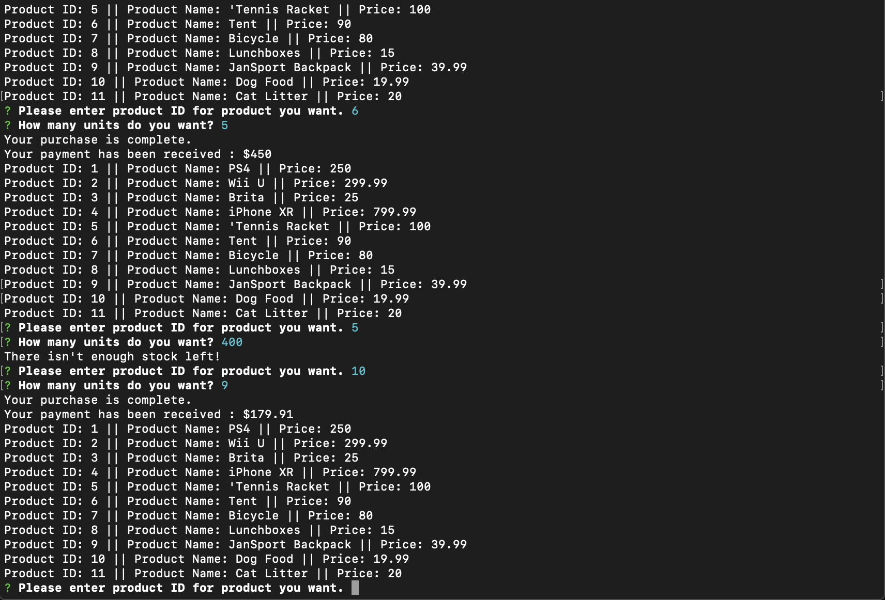
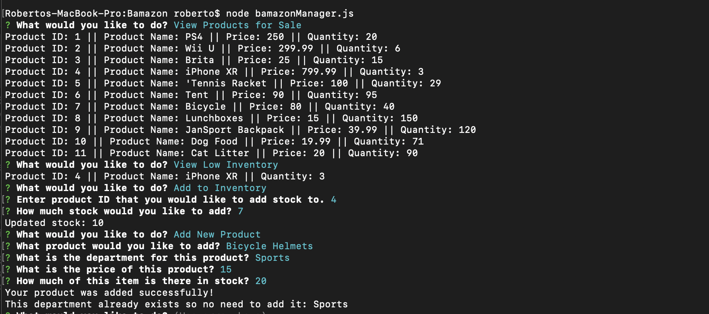
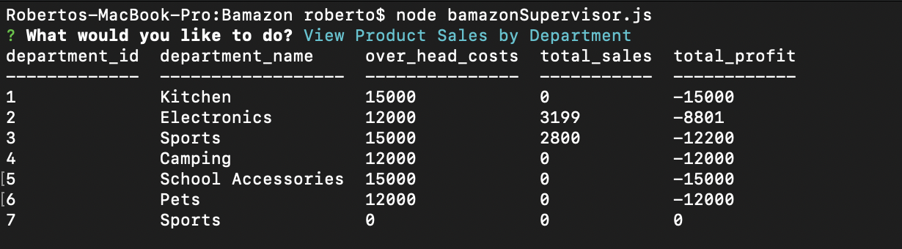

# Bamazon

This app is a basic e-commerce app that allows users to select and purchase their favorite items, managers to view stock, and supervisors to evaluate the performance of a given department.
By using inquirer, SQL, and javascript, users can purchase a variety of different products, receive information about availability, and check the value of each purchase they make.

This app is also advantageous in that it allows managers and supervisors to view stock, add items, and evaluate which departments seem to be performing best.

By using one of three different inputs on the command line: bamazonManager.js, bamazonCustomer.js, and or bamazonSupervisor.js, each one of these has access to the relevant information they need in order to continue on with their bamazon experience.

This app works through the use of inquirer, SQL, and JS integration.

To run the app, you must open terminal, make sure that you are in the right directory, type in node followed by the name of the respective javascript file - in this case it is one of the three js files - and then follow the prompts delivered on the screen.

Here below are some examples of how the app functions within terminal:

Here is the manager aspect of the app in action. Allowing the manager to check and add inventory, as well as add products.

Here is a quick look at what the supervisor table looks like with overhead costs, total sales, and total profit.
